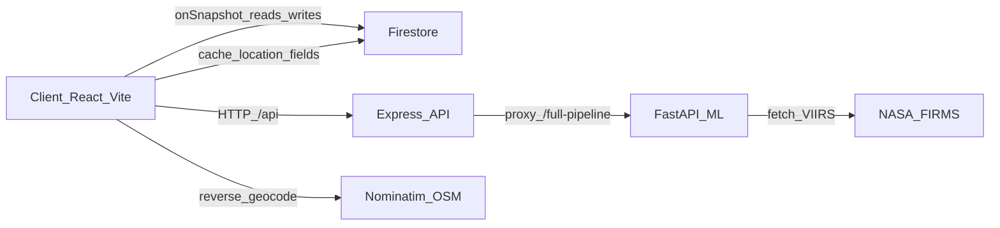

## WatchBurn
# Find the fire before it spread
**WatchBurn** is a production-ready, public-access full-stack web application for **AI-based illegal waste burning detection**. It combines a premium dark “ops satellite platform” UI with realtime Firestore event streams, analytics, exports, and a local ML service with graceful demo fallbacks.

### Architecture



### Folder structure

```
watchburn/
  client/         React 18 + TS + Vite + Tailwind UI
  server/         Express 5 + TS API (CORS open, demo fallbacks)
  ml_service/     FastAPI + PyTorch models + NASA FIRMS fetcher
  tailwind.config.ts
  vite.config.ts
  tsconfig.json
  package.json
```

### Setup

#### 1) Install dependencies

```bash
pnpm install
```

#### 2) Run web app (frontend + backend)

```bash
pnpm dev
```

- Frontend: `http://localhost:5173`
- Backend: `http://localhost:8080`

#### 3) Run ML service (optional)

In a second terminal:

```bash
cd ml_service
python app.py
```

ML health check: `http://localhost:5000/health`

### Firebase / Firestore integration

- Firebase Web SDK config is **hardcoded** in `client/lib/firebase.ts` (no `.env` required).
- Firestore collections used:
  - `events` — `WasteBurnEvent` documents
  - `clusters` — `Cluster` documents
- On first load, `initializeData()` seeds Firestore with 100 realistic mock events (only if `events` is empty).
- Frontend uses realtime listeners (`onSnapshot`) and **automatically falls back to demo mode** if Firestore throws any errors.

### NASA FIRMS integration

The ML service includes a VIIRS/FIRMS fetcher:

- Hardcoded key in `ml_service/utils/satellite_fetcher.py`
- URL shape: `https://firms.modaps.eosdis.nasa.gov/api/area/csv/<KEY>/VIIRS_SNPP_NRT/<bbox>/1`
- On any error, it returns **synthetic demo hotspots**.

### Demo mode behavior

If any external dependency fails, WatchBurn continues operating with realistic mock data:

- **Firestore**: client switches to mock events and disables writes.
- **NASA FIRMS**: returns synthetic hotspots.
- **ML service**: Express proxy returns a plausible mock inference payload.

### Example API responses

#### `POST /api/inference/full-pipeline`

```json
{
  "classification": "illegal_waste_burning",
  "confidence": 0.82,
  "class_probabilities": {
    "illegal_waste_burning": 0.82,
    "agricultural_fire": 0.06,
    "industrial_flare": 0.07,
    "natural_fire": 0.05
  },
  "smoke_probability": 0.87,
  "thermal_probability": 0.79,
  "ndvi": 0.21,
  "nbr": 0.12,
  "bai": 430
}
```

#### `GET /api/events/stats`

```json
{
  "total": 100,
  "high_risk": 46,
  "verified": 21,
  "pending": 69,
  "coverage_km2": 3500000
}
```

